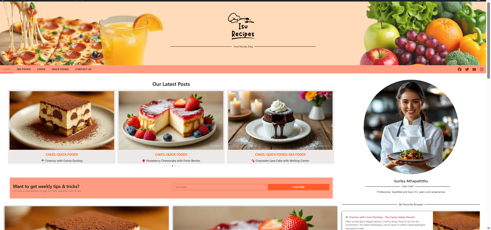
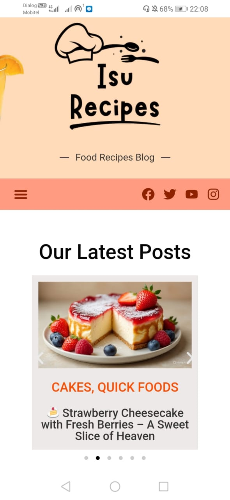
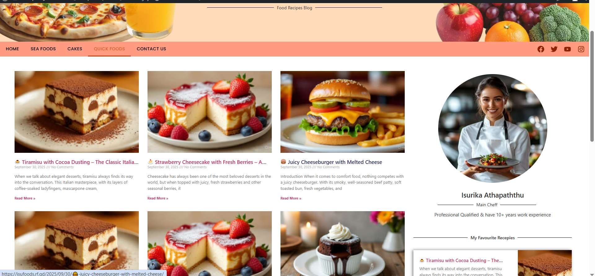
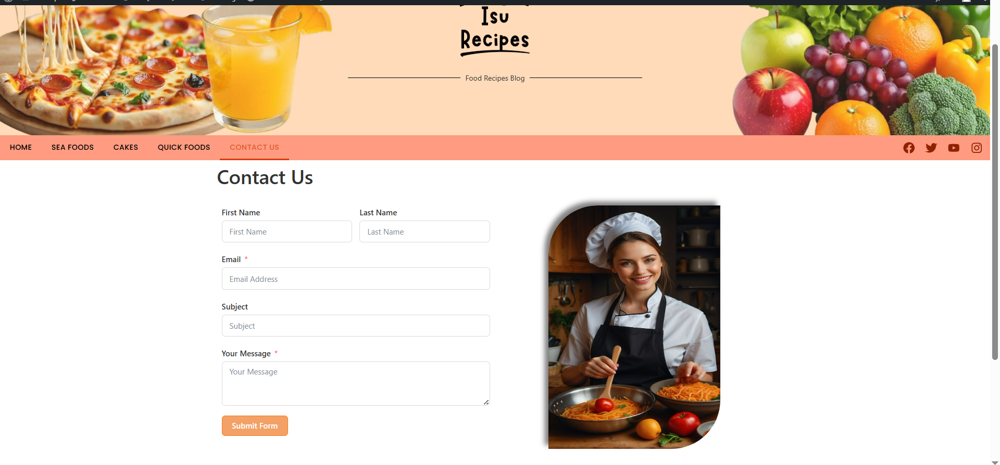
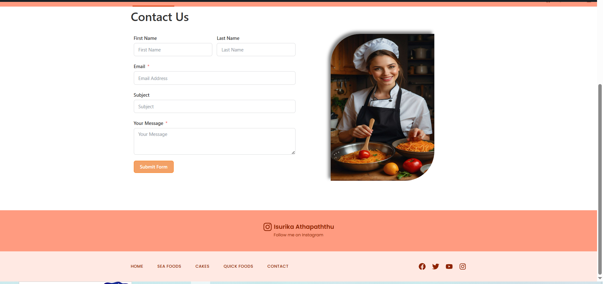

# 🍽️ Food Recipe Blog

A fully responsive **Food Recipe Blog** built with **WordPress** and **Elementor**, hosted on **InfinityFree**.  
This project reflects my passion for **web development**, focusing on **modern, responsive, and user-friendly websites**.

🔗 **Live Demo:** [Visit Website](https://isufoods.rf.gd)

---

## 🧠 Introduction

This Food Recipe Blog is designed to share delicious recipes in an **organized, aesthetic, and responsive** layout.  
Built using **WordPress**, customized with **Elementor** and the **Hello Elementor Theme** to achieve a smooth user experience across **desktop and mobile devices**.

---

## ⚙️ Development Process

- Installed WordPress  
- Installed Elementor & Elementor Pro Elements plugin  
- Installed Hello Elementor Theme  
- Created Home Page, Menu Page, Contact Page  
- Setup Global Colors and Fonts  
- Developed Header and Footer sections  
- Created Blog Posts and Post Pages  
- Developed Home Page Post Section and Featured Post Section  
- Developed Sidebar and Newsletter Sections  
- Ensured **full responsiveness** for desktop and mobile views  

---

## 📺 Screenshots

### 🖥️ Desktop vs 📱 Mobile View

<table>
<tr>
<td align="center">
<b>Homepage</b> 

</td>
<td align="center">
<b>Homepage Mobile</b> 

</td>
</tr>
<tr>
<td align="center">
<b>Post Page</b> 

</td>
<td align="center">
<b>Post Mobile</b> 

</td>
</tr>
<tr>
<td align="center">
<b>Contact Page</b> 

</td>
<td align="center">
<b>Contact Mobile</b> 

</td>
</tr>
<tr>
<td align="center">
<b>Footer Section</b> 

</td>
<td align="center">
<b>Footer Mobile</b> 

</td>
</tr>
<tr>
<td align="center">
<b>Menu Section</b> 

</td>
<td></td>
</tr>
</table>

---

## 💻 Features

- Fully responsive design for desktop and mobile  
- Clean, modern layout for easy readability  
- Blog post management system  
- Featured Post and Newsletter sections  
- Contact form integration  

---

## 🧩 Tools & Technologies

- **WordPress**  
- **Elementor / Elementor Pro Elements**  
- **Hello Elementor Theme**  
- **HTML, CSS, JavaScript**  
- **InfinityFree Hosting**

---

## 🧑‍💻 About Me

I’m **Isurika Athapaththu**, a **BSc Information Technology Graduate** from **Rajarata University**, passionate about **web development** and building **responsive websites**.

📫 **Connect with me:**  
- [GitHub](https://github.com/isurikaprathi97)  
- [LinkedIn](https://www.linkedin.com/in/isurikaathapaththu/)

---

✨ *Thank you for visiting my project! Explore the live site and feel free to share feedback.*
